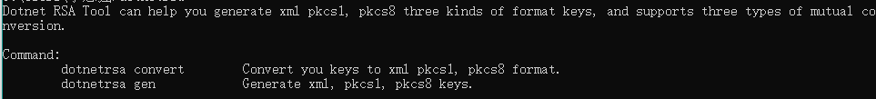

# DotnetRSA
DotnetRSA is a .NET Core Global Tool.Dotnet RSA Tool can help you generate xml pkcs1, pkcs8 three kinds of format keys, and supports three types of mutual conversion.

## Get Start

### 1.Open CMD

## 2.Install

````shell
dotnet tool install --global dotnetrsa
````

### 3.Usage

````shell
dotnetrsa
````


