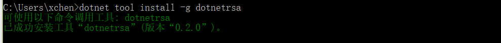
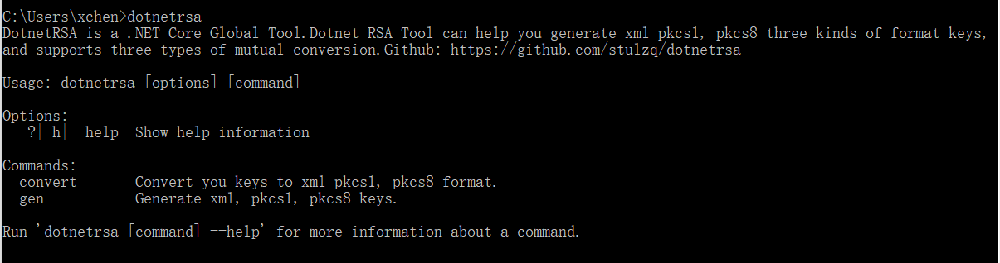

# 开源工具 DotnetRSA 快速生成和转换RSA秘钥

## 一.简介

DotnetRSA 是一个利用 .NET Core 2.1 开发的 .NET Global Tool，是可以想npm全局安装一样，安装在你的系统中，只需敲一行命令便可以快速生成RSA加密算法所需的秘钥，目前支持三种格式的秘钥，分别为：xml、pkcs1、pkcs8。它还支持三种格式秘钥的想换转换。

## 二.安装

> 使用 DotnetRSA 需要你的系统具备.NET Core >=2.1 的环境，若没有请访问官网，按照提示进行安装：https://www.microsoft.com/net/learn/get-started/windows

输入一句命令便可以安装：

````shell
dotnet tool install -g dotnetrsa
````

安装成功会有如下提示：



同时输入命令 `dotnetrsa` 会出现如下提示：



## 三.使用

### 1.生成秘钥

生成秘钥使用命令 `dontetrsa gen`，加入 `-h` 获取帮助：

````shell
Generate xml, pkcs1, pkcs8 keys.

Usage: dotnetrsa gen [options]

Options:
  -h|--help           Show help information
  -f|--format         Required.Gen keys's format.The value must be xml, pkcs1 ,pkcs8.
  -s|--size <int>     Key Size.Default 2048.
  --pem               Pem Format. true of false.Default false.
  -o|--output <path>  File output path.If you do not specify it will be output in the current directory.
````

-f 或者 --format：指需要生成的格式，可以为 xml、pkcs1、pkcs8

-s 或者 --size ：指需要生成的秘钥长度，默认为2048

--pem ：只是否带有pem格式，值为 true 或者 false，默认为 false

-o 或者 --output ：指秘钥保存的路径，默认保存在当前文件夹

生成一个长度为2048的xml格式的秘钥示例：

````shell
dotnetrsa gen -s 2048 -f xml
````

### 2.转换秘钥

转换秘钥使用命令 `dontetrsa convert ，加入 `-h` 获取帮助：

````shell
Usage: dotnetrsa convert [arguments] [options]

Arguments:
  KeyFilePath         Required.Secret key file path.

Options:
  -h|--help           Show help information
  -f|--from <format>  Required.Source format.The value must be xml, pkcs1,pkcs8.
  -t|--to <format>    Required.Target format.The value must be xml, pkcs1,pkcs8.
  -k                  Required.Key type.The value must be pri, pub.'pub' represents the public key.
  -o|--output <path>  File output path.If you do not specify it will be output in the current directory.
````

KeyFilePath：指定被转换的秘钥的路径

-f 或者 --from ：该字段为必须指定，指被转换的秘钥的格式，值只能为 xml、pkcs1、pkcs8

-t 或者 --to：该字段为必须指定，指需要转换的目标格式，值只能为 xml、pkcs1、pkcs8

-k ：指被转换的秘钥的类型，公钥或者私钥，值只能为 pri 或者 pub ，分别代表公钥和私钥

-o ：转换的秘钥的输出路径，默认为当前目录

将一个格式为xml的私钥转换为pkcs1，示例：

````shell
dotnetrsa convert c:\xml_private.key -f xml -t pkcs1 -k pri
````

## 四.参考资料

DotnetRSA 生成和转换秘钥使用了开源项目 RSAUtil ：https://github.com/stulzq/RSAUtil

DotnetRSA 的开源地址：https://github.com/stulzq/dotnetrsa